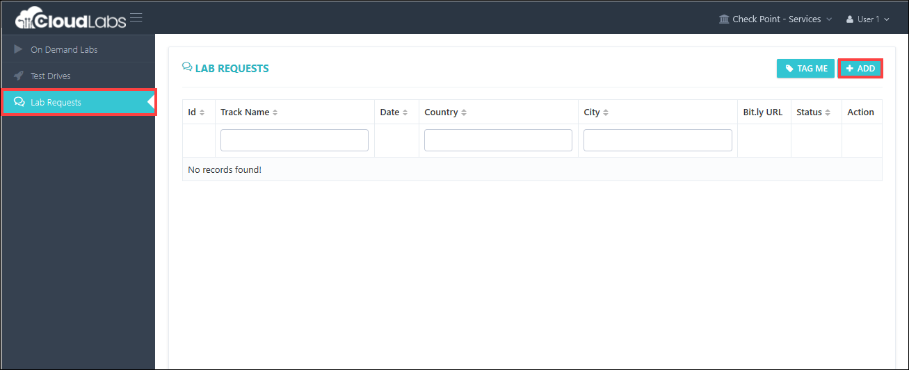
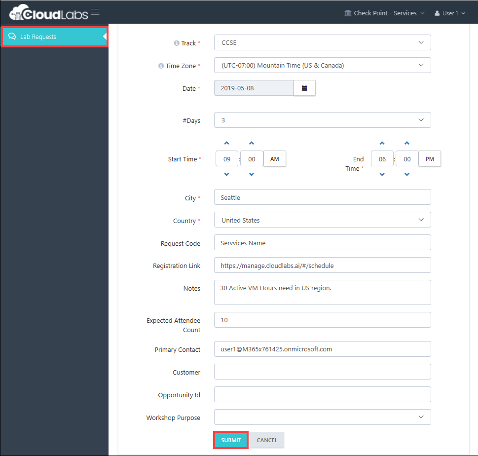
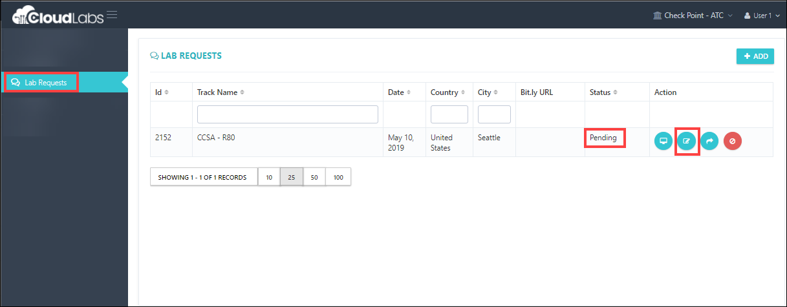
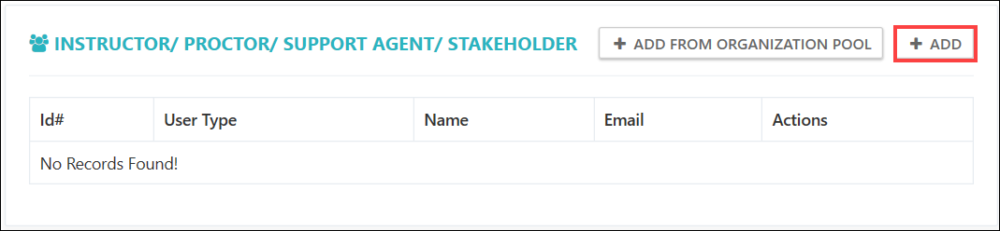
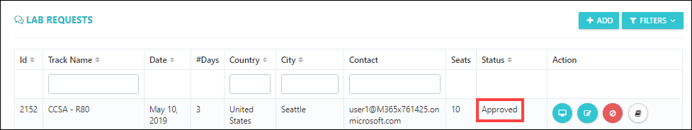

[Home](./../README.md)

## Raising Lab Request

i. Navigate to https://admin.cloudlabs.ai/

ii. Click on Log in button on right top of the page & Sign-in.

iii. Select Tenant - Check Point-Services / Check Point-ATC / **Sophos Training / Sophos Support**

Ensure you are connected to Check Point-Services / Check Point-ATC / **Sophos Training / Sophos Support** - Tenant.

> If you don't see Check Point-Services/ ATC / **Sophos Training / Sophos Support** - Tenant drop down, send email to **cloudlabs@spektrasystems.com** 

iv. Once you logged in, you navigate through the menu items on the left.

v. Navigate to **Lab Requests**.

vi. From the **Lab Request** page, click on **Add** button to create a new request.

vii. Select the available tracks, if you're requesting under **Check Point-Services Tenant**.

* CCSA - R80.10
* CCSE
* CCSM
* Advanced Troubleshooting
* Advanced VSX R80.x
* Check Point Services - Dedicated AWS accounts
* Check Point Services - Dedicated Azure accounts
* Check Point Services - Dedicated GCP accounts

**AND**

vii. Select the available tracks, if you're requesting under **Check Point-ATC Tenant**.

* CCSA
* CCSE

**AND**

viii. Select the available tracks, if you're requesting under **Check Point ATC Tenant**.

* F5 Network Training

**Sophos Training / Sophos Support**

* XG Firewall 17.5 Architect

**Fill out the request information**

> Request Code - Services Name (For Check Point-Services)

> Request Code - ATC Name (For Check Point-ATC)

> **Notes**
* How many VM hours do you need
* Do you need students to start/stop VM
* Do you want to keep activation code?
* Regions for the deployment?
* Expected Attendee Count
* Click on **Submit** button.

    

**Now request is in Pending for approval**.
You can **edit** the request to make further changes.

viii. If you made request by mistake, you can cancel it at this stage.

ix. You can continue to edit the requests.

x. It is very likely that the Instructor for the specific lab is different from the lab requestor.

xi. You can **add instructor** to the lab request.

xii. You can **add multiple instructors** if needed. 

xiii. Now request is still **Pending** for approval 

**Spektra team will review the request and respond back in 24 Hours**

xiv. Now the request is in **Approved state**

## Typically one week prior to the workshop, Spektra team will **schedule** the **Lab**

You get **Lab Activation URL** for attendees (bit.ly)
* You can request for eariler lab activation
* You also get access to lab configuration

Now, you have two navigation items on the left 
* **On Demand Labs** is visible now (play button)

## Navigate to On Demand Labs

Why 60 Hours duration
* You have requested for 3 days
* 12+2*24 -> **60**

Lab environment will be available for 60 hours, during that period, Virtual Machine can be executed for 30 hours
* VM Hours can be enforced

[Back](./Module-1-Login-to_CloudLabs-portalreadme.md)&nbsp;&nbsp;&nbsp;&nbsp;&nbsp;&nbsp;&nbsp;&nbsp;&nbsp;&nbsp;&nbsp;&nbsp;&nbsp;&nbsp;&nbsp;&nbsp;&nbsp;&nbsp;&nbsp;&nbsp;&nbsp;&nbsp;&nbsp;&nbsp;&nbsp;&nbsp;&nbsp;&nbsp;&nbsp;&nbsp;&nbsp;&nbsp;&nbsp;&nbsp;&nbsp;&nbsp;&nbsp;&nbsp;&nbsp;&nbsp;&nbsp;&nbsp;&nbsp;&nbsp;&nbsp;&nbsp;&nbsp;&nbsp;&nbsp;&nbsp;&nbsp;&nbsp;&nbsp;&nbsp;&nbsp;&nbsp;&nbsp;&nbsp;&nbsp;&nbsp;&nbsp;&nbsp;&nbsp;&nbsp;&nbsp;&nbsp;&nbsp;&nbsp;&nbsp;&nbsp;&nbsp;&nbsp;&nbsp;&nbsp;&nbsp;&nbsp;&nbsp;&nbsp;&nbsp;&nbsp;&nbsp;&nbsp;&nbsp;&nbsp;&nbsp;&nbsp;&nbsp;&nbsp;&nbsp;&nbsp;&nbsp;&nbsp;&nbsp;&nbsp;&nbsp;&nbsp;&nbsp;&nbsp;&nbsp;&nbsp;&nbsp;&nbsp;&nbsp;&nbsp;&nbsp;&nbsp;&nbsp;&nbsp;&nbsp;&nbsp;&nbsp;&nbsp;&nbsp;&nbsp;&nbsp;&nbsp;&nbsp;&nbsp;&nbsp;&nbsp;[Next](./Module_3_Test_Drive_readme.md#test-drives)
