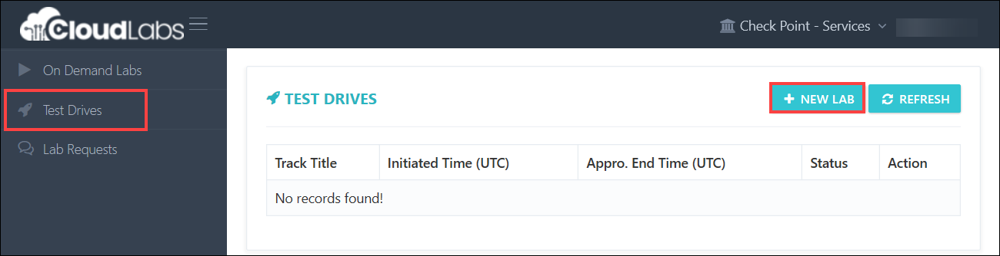
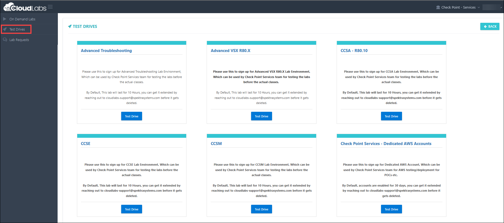
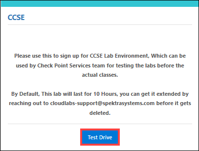
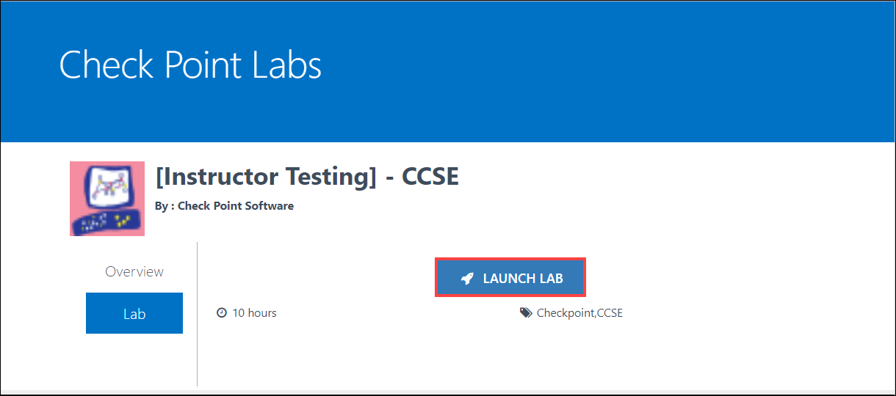
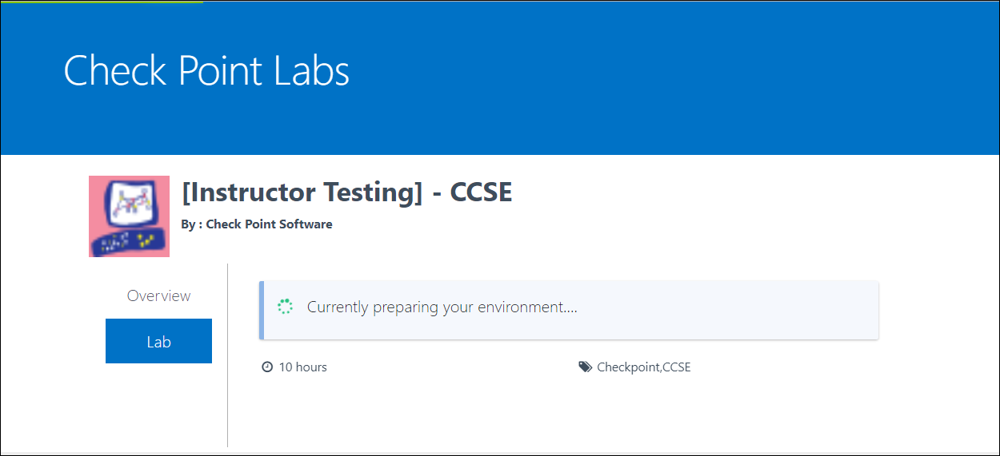
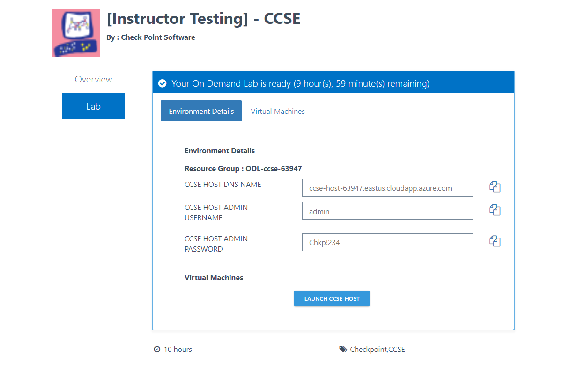

[Home](./../README.md)

# Test Drives

Navigate to **CloudLabs Portal**: https://admin.cloudlabs.ai/

> Please follow the below steps to access the **Test Drives**.

i. Select **Test Drives** on the left hand side dashboard, then click on **New Lab**  on the top right hand side. 
 

ii. You would be redirected to the a new page which contains the list of **Test Drives**

iii. As per your requirement, you can choose any available track and click on **Test Drive**

iv. You would be prompted to launch lab page, where you would need to **Launch** the lab

v. Once you Launch the lab, it will take around 15 minutes to prepare a lab environment.

vi. Once your lab envornment is ready, you'll recieve lab details on the same page and on email as well.

[Back](./Module_2_Raising_Lab_Request_readme.md)&nbsp;&nbsp;&nbsp;&nbsp;&nbsp;&nbsp;&nbsp;&nbsp;&nbsp;&nbsp;&nbsp;&nbsp;&nbsp;&nbsp;&nbsp;&nbsp;&nbsp;&nbsp;&nbsp;&nbsp;&nbsp;&nbsp;&nbsp;&nbsp;&nbsp;&nbsp;&nbsp;&nbsp;&nbsp;&nbsp;&nbsp;&nbsp;&nbsp;&nbsp;&nbsp;&nbsp;&nbsp;&nbsp;&nbsp;&nbsp;&nbsp;&nbsp;&nbsp;&nbsp;&nbsp;&nbsp;&nbsp;&nbsp;&nbsp;&nbsp;&nbsp;&nbsp;&nbsp;&nbsp;&nbsp;&nbsp;&nbsp;&nbsp;&nbsp;&nbsp;&nbsp;&nbsp;&nbsp;&nbsp;&nbsp;&nbsp;&nbsp;&nbsp;&nbsp;&nbsp;&nbsp;&nbsp;&nbsp;&nbsp;&nbsp;&nbsp;&nbsp;&nbsp;&nbsp;&nbsp;&nbsp;&nbsp;&nbsp;&nbsp;&nbsp;&nbsp;&nbsp;&nbsp;&nbsp;&nbsp;&nbsp;&nbsp;&nbsp;&nbsp;&nbsp;&nbsp;&nbsp;&nbsp;&nbsp;&nbsp;&nbsp;&nbsp;&nbsp;&nbsp;&nbsp;&nbsp;&nbsp;&nbsp;&nbsp;&nbsp;&nbsp;&nbsp;&nbsp;&nbsp;&nbsp;&nbsp;&nbsp;&nbsp;&nbsp;&nbsp;[Next](./Module_4_Scheduling_VMs_Stop_Start_readme.md)
