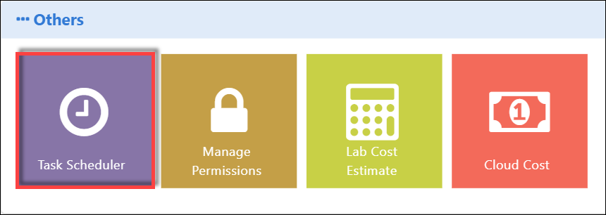
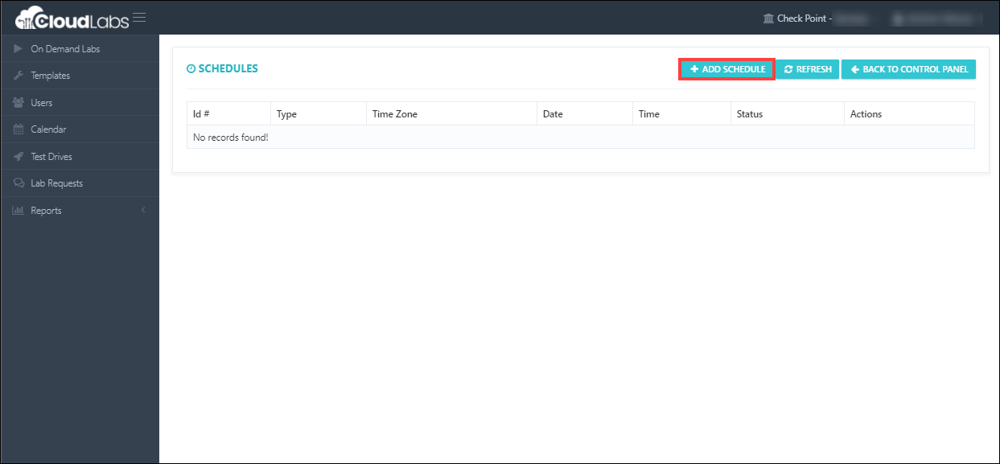
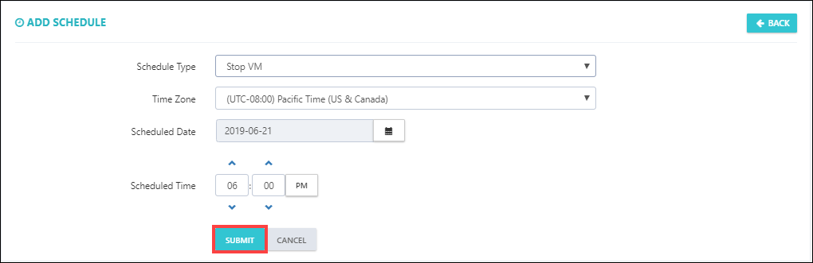
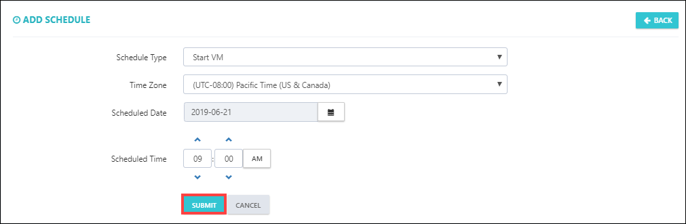

[Home](./../README.md)

# Scheduling Virtual Machines Stop / Start

Since these are multiple day events, you can schedule start and stop of Virtual Machines as per your requirement. 

Please follow the below steps to add schedule to start and stop VM's

i. Open the control panel as shown in below image. 

  

ii. Then, scroll down and find **Task Scheduler** option.

iii. Click on **Task Scheduler**

iv. Click on **+ Add Schedule** for Virtual Machines **Stop**

 
v. Fill out all the required fields:

* Scroll down, and select schedule type **Stop VM**
* Select your Time Zone
* Select Schduled Date and Time, then click on **submit** button to save. 

 

iv. Now, again click on **+ Add Schedule** for Virtual Machines **Start**

 
v. Fill out all the required fields:

* Scroll down, and select schedule type **Start VM**
* Select your Time Zone
* Select Schduled Date and Time, then click on **submit** button to save. 

 

[Back](./Module_3_Test_Drive_readme.md)&nbsp;&nbsp;&nbsp;&nbsp;&nbsp;&nbsp;&nbsp;&nbsp;&nbsp;&nbsp;&nbsp;&nbsp;&nbsp;&nbsp;&nbsp;&nbsp;&nbsp;&nbsp;&nbsp;&nbsp;&nbsp;&nbsp;&nbsp;&nbsp;&nbsp;&nbsp;&nbsp;&nbsp;&nbsp;&nbsp;&nbsp;&nbsp;&nbsp;&nbsp;&nbsp;&nbsp;&nbsp;&nbsp;&nbsp;&nbsp;&nbsp;&nbsp;&nbsp;&nbsp;&nbsp;&nbsp;&nbsp;&nbsp;&nbsp;&nbsp;&nbsp;&nbsp;&nbsp;&nbsp;&nbsp;&nbsp;&nbsp;&nbsp;&nbsp;&nbsp;&nbsp;&nbsp;&nbsp;&nbsp;&nbsp;&nbsp;&nbsp;&nbsp;&nbsp;&nbsp;&nbsp;&nbsp;&nbsp;&nbsp;&nbsp;&nbsp;&nbsp;&nbsp;&nbsp;&nbsp;&nbsp;&nbsp;&nbsp;&nbsp;&nbsp;&nbsp;&nbsp;&nbsp;&nbsp;&nbsp;&nbsp;&nbsp;&nbsp;&nbsp;&nbsp;&nbsp;&nbsp;&nbsp;&nbsp;&nbsp;&nbsp;&nbsp;&nbsp;&nbsp;&nbsp;&nbsp;&nbsp;&nbsp;&nbsp;&nbsp;&nbsp;&nbsp;&nbsp;&nbsp;&nbsp;&nbsp;&nbsp;&nbsp;&nbsp;&nbsp;[Next](./Module_5_Managing_the_Labs_readme.md)
