[Home](./../README.md)

# Managing the Users & VMs to a Lab

## 1. Adding and Managing the Users to a Lab

**As an Instructor, you would have permissions enabled to manage the users in the CloudLabs portal to a specific On Demand Lab.**

> Please follow the below steps which graphically explains on how to manage users:

i. You would have access to a specific **On Demand Lab**, click on **Users** button in Actions pane

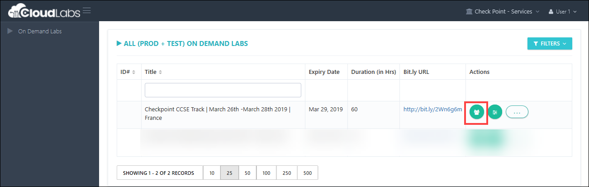
ii. Got attendee list already? Use **Add User** fucntionality to add users to the lab

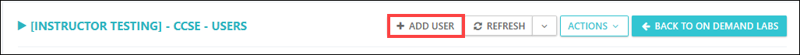
iii. Fill out required information, then click on **Submit** button

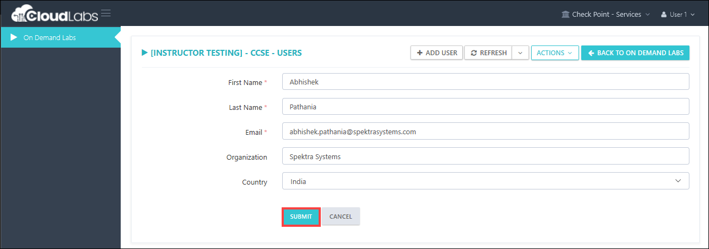
iv. Once user is added, send email to user so that he can activate the lab environment

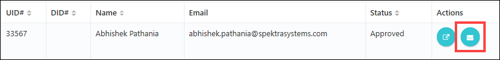

## 2. Managing the VMs from Control panel.

i. Open the control panel as shown in below image. 

  

ii. Stop the Virtual Machines.

If you want to stop all the Virtual Machines for a specific On Demand Lab, you can stop all VMs together by clicking on **Stop VM**.  

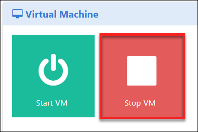  

iii. Start the Virtual Machines.

If you want to stop all the Virtual Machines for a specific On Demand Lab, you can start all VMs together by clicking on **Start VM**.   
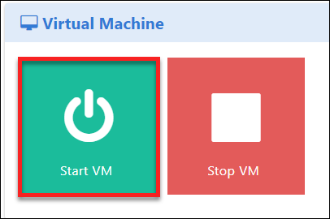  

iv. Virtual Machine Usage.

You can find the VM usage hours by clicking on VM usage option.  

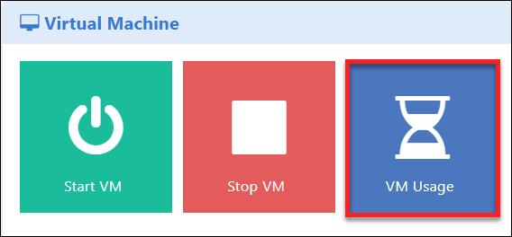  

v. You can also schedule the tasks like Stop/Start the Vms as per your requirement, click on task scheduler.

vi. You'd need to add the schedule, following is showing adding schedule for Stop VM.

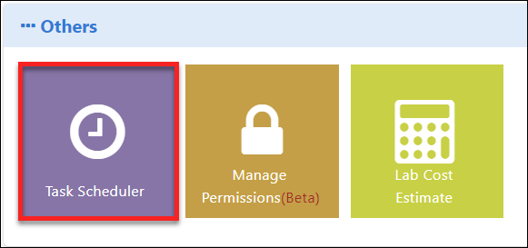  
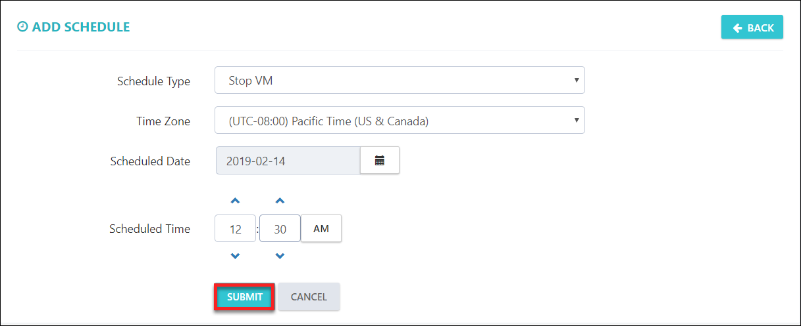 

## 3. Deleting Users Lab
i. If you want to delete the single user's lab environment, click on delete option

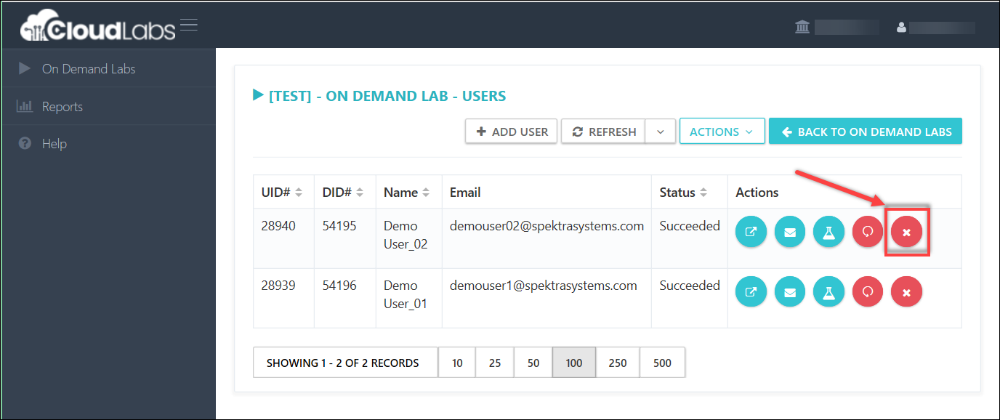
 
ii. You can also delete the users in bulk, click on **ACTIONS** button then click on **delete deployments**

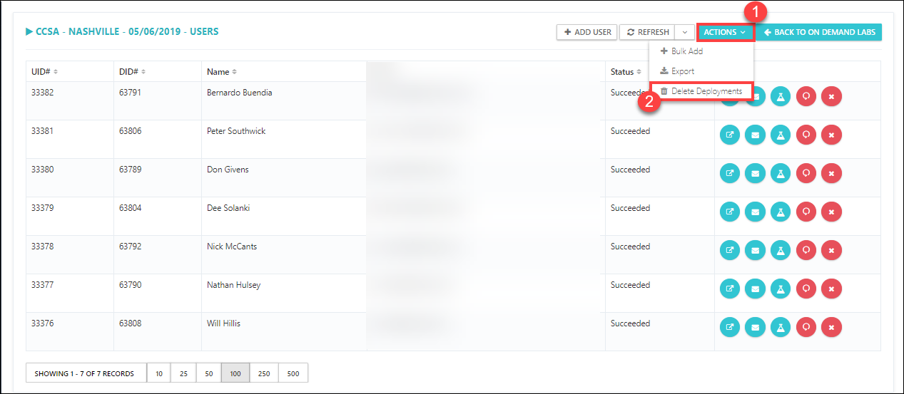

[Back](./Module_4_Scheduling_VMs_Stop_Start_readme.md)&nbsp;&nbsp;&nbsp;&nbsp;&nbsp;&nbsp;&nbsp;&nbsp;&nbsp;&nbsp;&nbsp;&nbsp;&nbsp;&nbsp;&nbsp;&nbsp;&nbsp;&nbsp;&nbsp;&nbsp;&nbsp;&nbsp;&nbsp;&nbsp;&nbsp;&nbsp;&nbsp;&nbsp;&nbsp;&nbsp;&nbsp;&nbsp;&nbsp;&nbsp;&nbsp;&nbsp;&nbsp;&nbsp;&nbsp;&nbsp;&nbsp;&nbsp;&nbsp;&nbsp;&nbsp;&nbsp;&nbsp;&nbsp;&nbsp;&nbsp;&nbsp;&nbsp;&nbsp;&nbsp;&nbsp;&nbsp;&nbsp;&nbsp;&nbsp;&nbsp;&nbsp;&nbsp;&nbsp;&nbsp;&nbsp;&nbsp;&nbsp;&nbsp;&nbsp;&nbsp;&nbsp;&nbsp;&nbsp;&nbsp;&nbsp;&nbsp;&nbsp;&nbsp;&nbsp;&nbsp;&nbsp;&nbsp;&nbsp;&nbsp;&nbsp;&nbsp;&nbsp;&nbsp;&nbsp;&nbsp;&nbsp;&nbsp;&nbsp;&nbsp;&nbsp;&nbsp;&nbsp;&nbsp;&nbsp;&nbsp;&nbsp;&nbsp;&nbsp;&nbsp;&nbsp;&nbsp;&nbsp;&nbsp;&nbsp;&nbsp;&nbsp;&nbsp;&nbsp;&nbsp;&nbsp;&nbsp;&nbsp;&nbsp;&nbsp;&nbsp;[Next](.//Module_6-View_VM-Uptime_readme.md)

