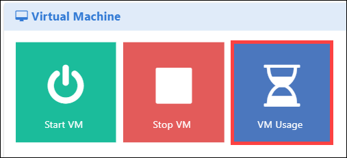
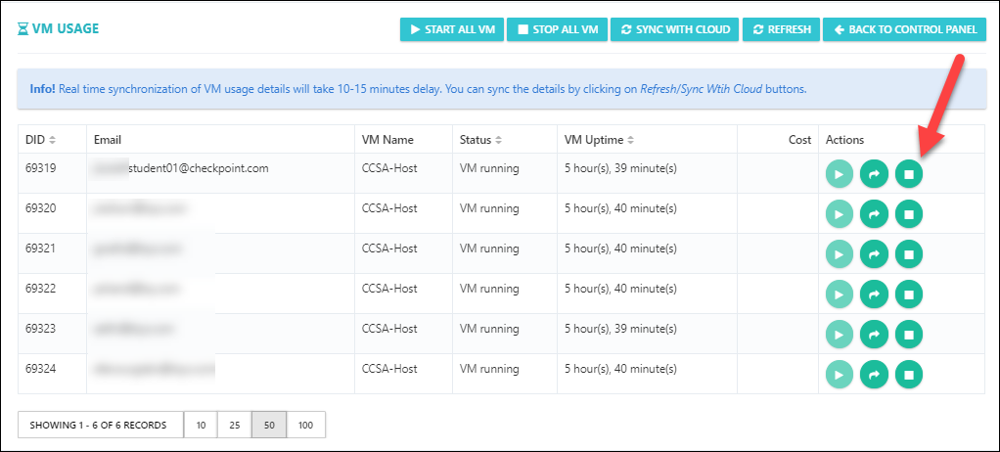
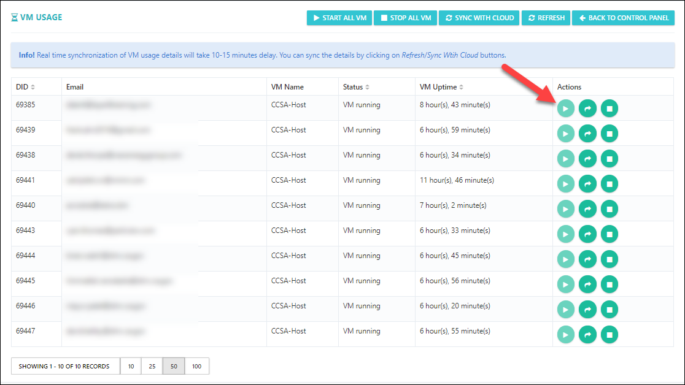

# Stop / Start the Virtual Machine for a Single User

You can also stop / start the virtual machine for a single user, please follow the below steps:

i. Open the control panel as shown in below image. 

  

ii. Select **VM Usage** under Virtual Machine option

  

iii. Now, you can see the Virtual Machines as running state with the student emails, if you want to stop a Virtual Machine for a single user you can do that from this page. 

iv. Click on **Stop** button, if you want to stop a single user VM.

 

v. Click on **Start** button, if you want to start a single user VM.

 
