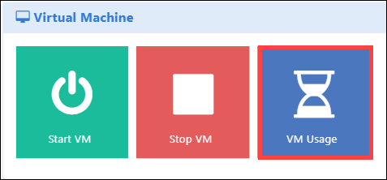
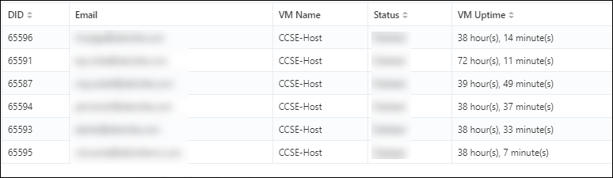
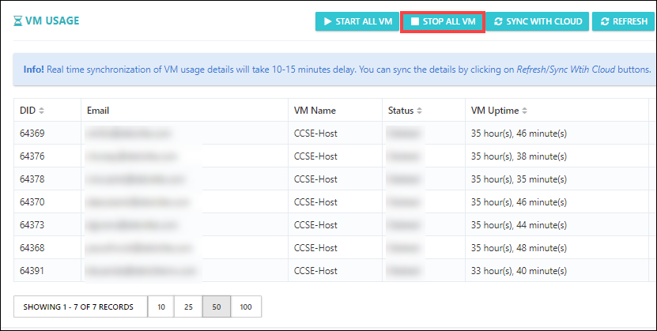

[Home](./../README.md)

# View Virtual Machines Up-Time (Running Hours)

You can also monitor the VM usage (uptime) and status (running or stopped) and then keep them under control. 

i. Open the control panel as shown in below image. 

  

ii. Click on **VM Usage**

  

iii. Then, you'll be able to view the Virtual Machine's Up-time for all the users. 

  

iv. If, in case you find that VMs are over running than expected, then you can also stop the VMs from the same page. 

  

[Back](./Module_5_Managing_the_Labs_readme.md)
